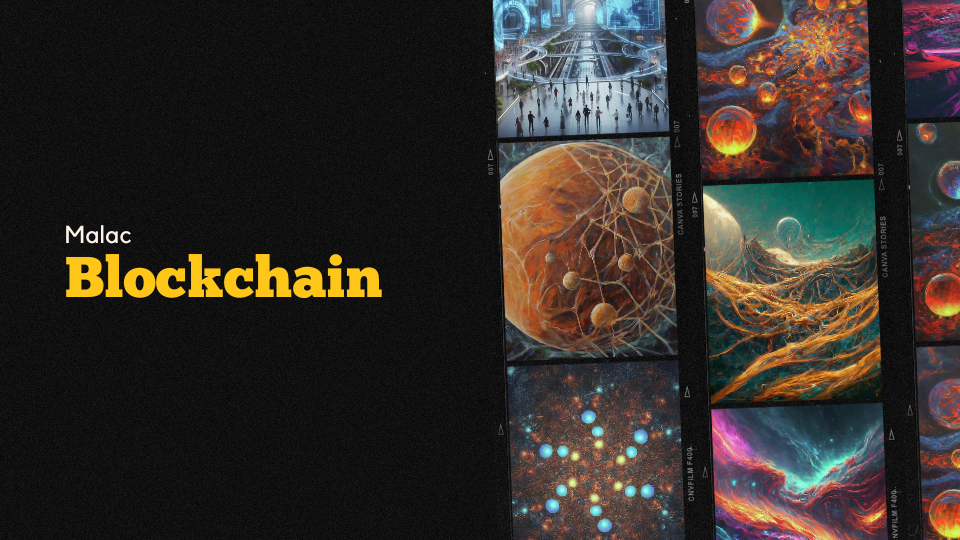

# The Malac Blockchain

A production-level decentralized and open-source blockchain platform built using `Node.js` for main tasks and `C` for performance-critical network tasks, also It's very easy and scalable. Inspired by the likes of Ethereum, Solana, and Bitcoin. Also, It uses a Proof-of-Work consensus mechanism to secure the validation process.

## **Components**

* **Proof-of-Work Consensus Mechanism**: To validate transactions and ensure the integrity of the network.
* **Decentralized Network**: Decentralized network of interconnected nodes, ensuring that there is no single point of failure.
* **API Server**: To interaction with the blockchain from the internet.
* **Consensus Algorithm**: For data legitimate and always synchronized.
* **Block Explorer:** very simple UI for Blockchain data explorer intigrated with eth-data-library. 

## **High-level overview of Architecture and Design**

## **Goals**

* To create a secure, decentralized, and scalable blockchain platform.
* To create a user-friendly interface for interacting with the blockchain.
* To master how blockchain works.